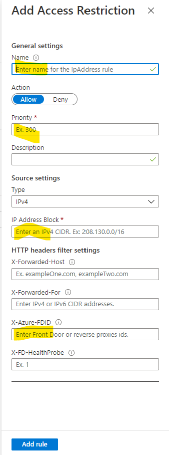

# NGINX proxy on Azure App Services

This repo describes how to setup an NGINX proxy in a container to allow forwarding of all requests to another web app that is itself locked-down. it makes use of NGINX to insert an HTTP header into requests, that the access restriction part of the target web app inspects to validate requests.

The scenario is a restricted set of third-party users need to access a locked down web app for maintennce purposes. This could be done using Azure app services authentication, but in this case using a proxy is more practical.

This will cover both the proxy configuration and the target web app configuration.

## The proxy
NGINX is a ubiquitous proxy software package. It has a well known set of rules which allow the many scenarios. But for this, we will be using the simplest arrangement of proxying requests to an onwards server - whilst injecting a specific header into all of the requests that the target web app will test to authorise access.

The conmfiguration of NGINX is defined below
```
server {
    location / {
        proxy_pass  https://the-target-web-app.azurewebsites.net;
        proxy_set_header  X-Azure-FDID  some-guid;
    }
}
```
In the above, the target web site is an Azure app service. This is hardcoded, but could be parameterised. Likewise, the header "X-Azure-FDID" has been *borrowed* as Azure App services access restriction can test for this value.

One of the simplest method of deployment is to create a container for this. The Dockerfile is:

```
FROM nginx:latest
COPY ./nginx.conf /etc/nginx/conf.d/default.conf
```
As can be seen above the NGIX configuration file named *nginx.conf* is copied to the destination */etc/nginx/conf.d/default.conf*

That's all there is. As this is docker, you need to do:
1. Docker build
2. Docker tag
3. Docker push

The docker image can then be run in some container host.

## Configuration of target Azure app service
The target app service needs to be set up with *access restriction*. This can be found under *Networking*


If you click on *Access Restriction* you get:


You can then setup an access rule. Press *Add Rule*:



The items highlighted above need to be entered:
1. There needs to be a name for the rule
2. There needs to be a priority, 300 is good.
3. You need to set the source IP address of the proxy. This is in CIDR notation.
4. You need to set the FDID to be the same as that of the proxy. This can be a GUID or something else. This is just hijacking the mechanism that Azure front door uses to identify to an app service which instance of front door is making the requests. As can be seen, there are some other HTTP header choices, but to use these, the NGINX configuration file will need to be amended to inject that header.

## Summary
There are a number of means of performing access restriction on an app service to a selected audience. The use of a proxy is one such measure. By using NGINX in a container, this can be setup very quickly.


